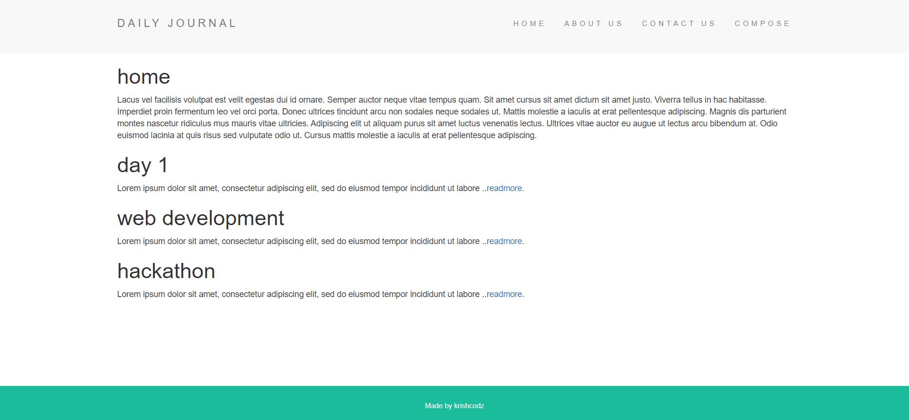

# Blog site web application
A blog web applcation using ejs templating.

# How to run
1.clone the repository

2.extract files and open terminal 

3.run the following commands:
first run,
```
npm install
```
then run,
```
node app.js
```
4. open the following link : http://localhost:3000/

# Snapshot

